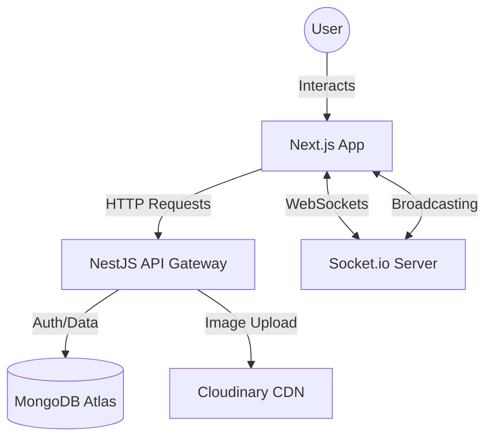

# 🏎️ Live Bidding App

[](https://nextjs.org/)
[](https://nestjs.com/)
[](https://www.mongodb.com/)
[](https://socket.io/)
[](https://tailwindcss.com/)
[](https://vercel.com/)

A premium, full-stack real-time car auction platform designed for high performance and seamless user experience. Browse, bid, and sell cars with instant real-time updates powered by WebSockets.

---

## 🌟 Key Features

- **🚀 Real-Time Bidding**: Powered by Socket.io for instant bid updates across all users without page refreshes.
- **⏱️ Live Auction Timer**: Precise countdown timers that stay in sync with the server time.
- **🚗 Sell Your Car**: Seamless car listing flow with multi-image upload to Cloudinary and detailed specifications.
- **🔐 Secure Authentication**: Robust JWT-based authentication with protected routes for bidding and car management.
- **📱 Responsive Design**: Fully optimized for mobile, tablet, and desktop viewing.
- **📊 Bidding Insights**: Real-time bidder lists and history on every auction details page.
- **🖼️ Image Gallery**: High-performance image gallery with zoom and preview functionality.
- **🔔 Interactive Notifications**: Instant feedback via Sonner for bidding successes and updates.
- **💡 Server Awareness**: Intelligent modal system to handle and inform users about free-tier server cold starts.

---

## 🛠️ Tech Stack

### Frontend
- **Framework**: Next.js 16 (App Router)
- **State Management**: Zustand (Auth, Auction States)
- **Data Fetching**: TanStack Query (React Query)
- **Real-time**: Socket.io-client
- **Styling**: Tailwind CSS & Radix UI
- **Forms**: React Hook Form & Yup/Zod
- **Icons**: Lucide React

### Backend
- **Framework**: NestJS (v11)
- **Database**: MongoDB with Mongoose ODM
- **Real-time**: Socket.io & WebSockets
- **Auth**: Passport.js & JWT
- **Storage**: Cloudinary (Image management)
- **Security**: Helmet, Rate Limiting (Throttler), Compression
- **Documentation**: Swagger UI

---

## 🔄 Project Flow



---

## 📂 Project Structure

### 🏗️ Root
```text
.
├── auction-backend/    # NestJS Backend Service
├── auction-frontend/   # Next.js Frontend App
└── README.md           # Documentation
```

### 📂 Backend (`auction-backend/src`)
- **`auctions/`**: Core auction management logic.
- **`auth/`**: Authentication controllers and strategies (JWT).
- **`bids/`**: Real-time bidding controllers and services.
- **`cars/`**: Car listing schemas and management.
- **`cloudinary/`**: Integration for image storage.
- **`app.gateway.ts`**: Main WebSocket gateway for real-time events.

### 📂 Frontend (`auction-frontend/src`)
- **`app/`**: Next.js App Router (Pages, Layouts).
- **`components/`**: 
    - `bidding/`: Real-time bidding interfaces.
    - `cards/`: Premium car and auction listing cards.
    - `forms/`: Authentication and car listing forms.
    - `modals/`: Server awareness and interaction modals.
- **`hooks/`**: Custom hooks for data fetching (React Query) and real-time timers.
- **`providers/`**: Context providers for Socket.io and Query Client.
- **`stores/`**: Zustand stores for global state management.

---

## 🚀 Getting Started

### Prerequisites
- Node.js (v18 or later)
- npm or pnpm
- MongoDB instance (local or Atlas)
- Cloudinary account (for image uploads)

### 1. Installation

Clone the repository:
```bash
git clone https://github.com/maaliksaad/Live-Bidding-site.git
cd Live-Bidding-site
```

### 2. Backend Setup
```bash
cd auction-backend
npm install
```
Create a `.env` file in `auction-backend`:
```env
MONGODB_URI=your_mongodb_uri
JWT_SECRET=your_jwt_secret
CLOUDINARY_CLOUD_NAME=your_cloud_name
CLOUDINARY_API_KEY=your_api_key
CLOUDINARY_API_SECRET=your_api_secret
```
Run seeding to add dummy data:
```bash
npm run seed
```
Start the backend:
```bash
npm run start:dev
```

### 3. Frontend Setup
```bash
cd ../auction-frontend
npm install
```
Create a `.env.local` file in `auction-frontend`:
```env
NEXT_PUBLIC_API_URL=http://localhost:3001
NEXT_PUBLIC_SOCKET_URL=http://localhost:3001
```
Start the frontend:
```bash
npm run dev
```

---

## 🧪 Demo Credentials

For quick testing, use the built-in demo buttons on the login page or enter manually:

| Role | Username / Email | Password |
| :--- | :--- | :--- |
| **Seller 1** | `seller1@example.com` | `password123` |
| **Seller 2** | `seller2@example.com` | `password123` |
| **Seller 3** | `seller4@example.com` | `Password123` |

---

## 🛡️ License

This project is licensed under the UNLICENSED License - see the [package.json](file:///d:/netixsol/summer%20stacker/saadaziz/week5/Day-5/auction-backend/package.json) for details.

---

Created with ❤️ by **Saad**
